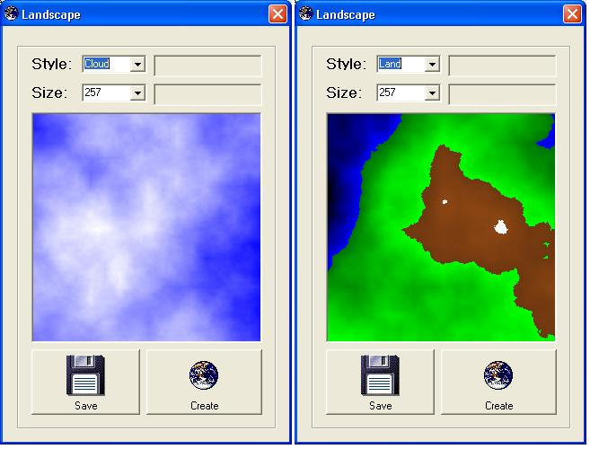

<div align="center">

## Fractal Clouds and Landscape


</div>

### Description

This code uses the same algorithm (Iterative Square Subdivision) to create either clouds or landscapes. In addition, it could be used to create plasma fractals and 3D mountain landscapes. This is all done randomly, so each picture is unique. I have also added the capability to save the picture. I have added my version of the save routine using common dialog.
 
### More Info
 


<span>             |<span>
---                |---
**Submitted On**   |2006-04-04 10:21:50
**By**             |[SixLetter](https://github.com/Planet-Source-Code/PSCIndex/blob/master/ByAuthor/sixletter.md)
**Level**          |Intermediate
**User Rating**    |5.0 (15 globes from 3 users)
**Compatibility**  |VB 6\.0
**Category**       |[Graphics](https://github.com/Planet-Source-Code/PSCIndex/blob/master/ByCategory/graphics__1-46.md)
**World**          |[Visual Basic](https://github.com/Planet-Source-Code/PSCIndex/blob/master/ByWorld/visual-basic.md)
**Archive File**   |[Fractal\_Cl198513442006\.zip](https://github.com/Planet-Source-Code/sixletter-fractal-clouds-and-landscape__1-64916/archive/master.zip)

### API Declarations

```
Private Declare Function SetPixel Lib "gdi32" (ByVal hdc As Long, ByVal x As Long, ByVal Y As Long, ByVal crColor As Long) As Long
```


